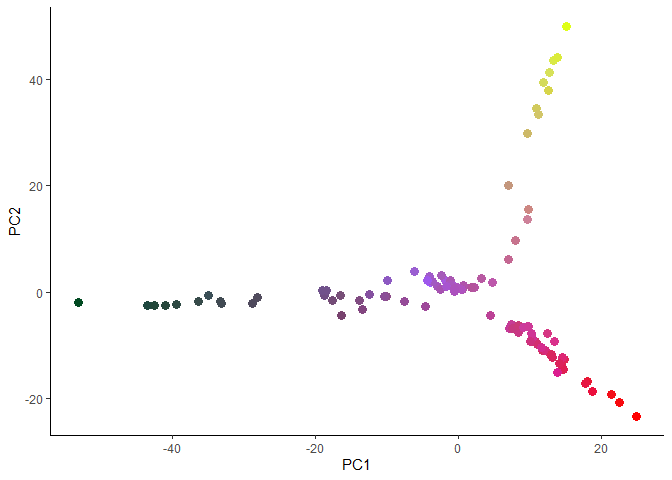
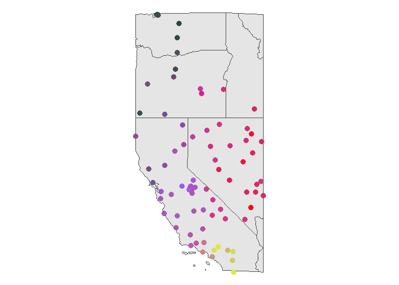

<!-- README.md is generated from README.Rmd. Please edit that file -->

# rainbowpca

rainbowpca is an R package for mapping multivariate structure using
RGB-encoded principal components. The package converts principal
component (PC) axes into red, green, and blue color channels, allowing
continuous variation in multivariate data to be visualized directly in
geographic space.

Although developed primarily for population genetic and landscape
genomic analyses, rainbowpca can be applied to any dataset where the
first three principal components capture meaningful continuous
structure.

## Installation

You can install the development version of rainbowpca from
[GitHub](https://github.com/) with:

``` r
# install.packages("pak")
pak::pak("AnushaPB/rainbowpca")
```

## Example

``` r

library(rainbowpca)
library(vcfR)
library(dplyr)
library(sf)
library(ggplot2)
library(tigris)

# Load example data
data("liz_coords")
data("liz_vcf")

# Extract genotype matrix
gt <- extract.gt(liz_vcf, element = "GT", as.numeric = TRUE)

# Impute missing values
gt[is.na(gt)] <- median(gt, na.rm = TRUE)

# Prepare matrix for PCA
gt <- t(gt)
gt <- gt[, apply(gt, 2, var) > 0]

# Run PCA
pca_result <- prcomp(gt, center = TRUE, scale. = TRUE)
pcs <- pca_result$x[, 1:3] # First three PCs

# Convert first three PCs to RGB colors
rgb_df <- pca_to_rgb(pcs)

# Combine coordinates and colors
plot_df <- 
  st_as_sf(liz_coords, coords = c("x", "y"), crs = 4326) %>%
  bind_cols(rgb_df) %>%
  bind_cols(pcs) 

# Load background map 
conus <- 
  states(cb = TRUE, resolution = "20m") %>%
  st_transform(crs = st_crs(plot_df)) %>%
  st_crop(plot_df)
```

``` r
# Plot PCA
ggplot(plot_df) +
  geom_point(aes(x = PC1, y = PC2, color = color), size = 3) +
  scale_color_identity() +
  theme_classic()
```



``` r

# Plot map
ggplot(plot_df) +
  geom_sf(data = conus) +
  geom_sf(aes(color = color), size = 3) +
  scale_color_identity() +
  theme_void()
```



This example maps continuous genetic structure in *Sceloporus
occidentalis* across California using RGB-encoded PCA axes.

## Note

RGB-based PCA visualization has been used previously in population
genetics and related fields, including methods such as
`adegenet::colorplot()`, some empirical studies (e.g., DOI:
10.1016/j.xpro.2023.102567), and the GDM package, which uses a similar
approach to visualize modelled compositional dissimilarity across space.
rainbowpca provides a streamlined and flexible workflow for these types
of visualizations.
